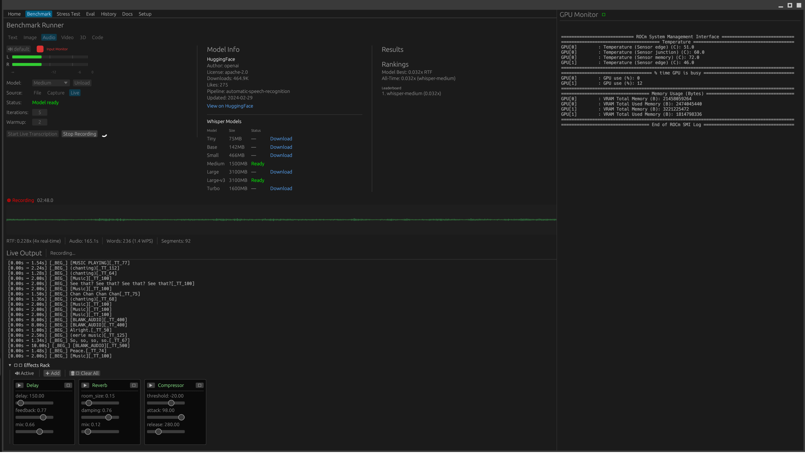
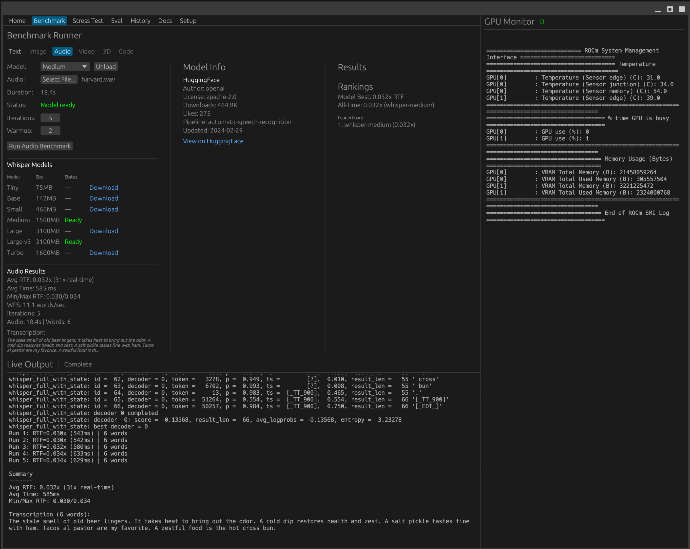

# LlamaBurn is a work in progress

A benchmarking, profiling, and stress-testing suite for local LLM models.

- **Performance benchmarks** — TTFT, TPS, inter-token latency metrics
- **Stress testing** — Ramp, sweep, sustained, spike modes
- **Accuracy evaluation** — LLM-as-Judge using Claude or GPT
- **Local model support** — Auto-discovers Ollama models
- **Native GUI** — egui/eframe desktop application






## Audio Benchmarking (WORK IN PROGRESS)

Six audio benchmark modes planned:

| Mode | Status | Description |
|------|--------|-------------|
| STT (Speech-to-Text) | Implemented | Whisper transcription with RTF metrics |
| TTS (Text-to-Speech) | Planned | Voice synthesis benchmarking |
| Music Separation | Planned | Demucs stem isolation |
| Music Transcription | Planned | Basic Pitch note detection |
| Music Generation | Planned | AudioCraft/MusicGen |
| LLM Music Analysis | Planned | Audio understanding via LLM |

### Building with Whisper (ROCm GPU)

```bash
# Install build deps
sudo apt install cmake clang

# Build with GPU acceleration (AMD ROCm)
cargo build -p llamaburn-gui --features whisper-gpu

# CPU-only build
cargo build -p llamaburn-gui --features whisper
```

Models download to `~/.local/share/llamaburn/whisper/`

### Benchmark Options

```bash
llamaburn benchmark <MODEL> [OPTIONS]

Arguments:
  <MODEL>    Model ID to benchmark (e.g., llama3.1:8b)

Options:
  -i, --iterations <N>    Number of iterations [default: 3]
  -w, --warmup <N>        Warmup runs [default: 1]
  -p, --prompts <FILE>    Prompts file (one per line)
  -t, --temperature <F>   Temperature [default: 0.7]
  -m, --max-tokens <N>    Max tokens to generate
  -o, --output <FILE>     Output JSON file
  --ollama-host <URL>     Ollama host [default: http://localhost:11434]
```

### Example Output

```
Model: llama3.1:8b

Iteration 1/3
  TTFT: 245.3 ms | TPS: 42.1 | Total: 1,523 ms

Iteration 2/3
  TTFT: 12.1 ms | TPS: 45.8 | Total: 1,412 ms

Iteration 3/3
  TTFT: 11.8 ms | TPS: 44.2 | Total: 1,456 ms

Summary:
  Avg TTFT: 89.7 ms
  Avg TPS: 44.0 (min: 42.1, max: 45.8)
  Avg Total: 1,463.7 ms
```

## CLI Usage

```bash
# Build the CLI
cd agent && cargo build --release -p llamaburn-cli

# List available models
llamaburn models

# Run benchmark
llamaburn benchmark llama3.1:8b --iterations 5

# Show system status
llamaburn status
```

### Commands

| Command | Description |
|---------|-------------|
| `models` | List available Ollama models |
| `benchmark` | Run benchmark tests on a model |
| `status` | Show system status |


## Architecture

```
┌───────────────────────────────────────────────────────────┐
│                    llamaburn-gui                          │
│                  (egui/eframe desktop)                    │
├───────────────────────────────────────────────────────────┤
│  Panels: Benchmark │ History │ Stress │ Eval │ Settings  │
└─────────────┬─────────────────────────────┬───────────────┘
              │                             │
┌─────────────┴─────────────┐ ┌─────────────┴───────────────┐
│   llamaburn-benchmark     │ │     llamaburn-services      │
│   - Text/Audio runners    │ │   - OllamaClient (HTTP)     │
│   - Metrics collection    │ │   - WhisperService (STT)    │
└─────────────┬─────────────┘ │   - HistoryService (SQLite) │
              │               └─────────────┬───────────────┘
┌─────────────┴─────────────────────────────┴───────────────┐
│                     llamaburn-core                        │
│            Types, config, benchmark definitions           │
└───────────────────────────────────────────────────────────┘
              │                             │
       ┌──────┴──────┐               ┌──────┴──────┐
       │   Ollama    │               │   Whisper   │
       │ (localhost) │               │ (whisper-rs)│
       └─────────────┘               └─────────────┘
```

## Prerequisites

- [Ollama](https://ollama.ai) running with models installed

```bash
ollama pull llama3.1:8b
ollama serve
```

## Building the GUI

```bash
cd agent
cargo build --release -p llamaburn-gui
./target/release/llamaburn-gui
```

For development with hot reload:

```bash
cargo watch -x 'run -p llamaburn-gui'
```

## Metrics

| Metric | Description |
|--------|-------------|
| **TTFT** | Time to first token (ms) |
| **TPS** | Tokens per second |
| **ITL** | Inter-token latency (ms) |
| **ISL** | Input sequence length |
| **OSL** | Output sequence length |


## Troubleshooting

### Ollama connection issues

If models aren't loading, ensure Ollama is running:

```bash
curl http://localhost:11434/api/tags
```

### Ollama bound to localhost only

If running Ollama on a different machine, configure it to accept external connections:

```bash
sudo mkdir -p /etc/systemd/system/ollama.service.d
echo -e '[Service]\nEnvironment="OLLAMA_HOST=0.0.0.0"' | sudo tee /etc/systemd/system/ollama.service.d/override.conf
sudo systemctl daemon-reload && sudo systemctl restart ollama
```

Verify it's listening on all interfaces:

```bash
ss -tlnp | grep 11434
# Should show 0.0.0.0:11434 instead of 127.0.0.1:11434
```

## License

MIT
